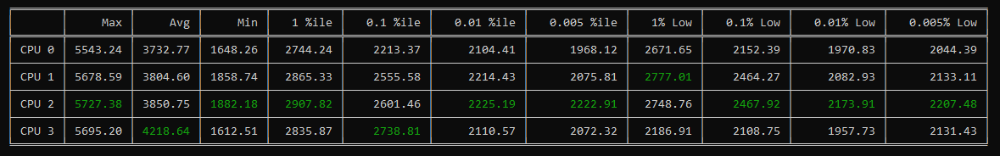

## AutoGpuAffinity

 

CLI tool to automatically benchmark the most performant core based on lows/percentile fps in [liblava](https://github.com/liblava/liblava).

Contact: https://twitter.com/amitxv


## Disclaimer
I am not responsible for damage caused to computer. There is a risk of your GPU driver not responding after restarting it during the tests.

## Maintaing a consistent benchmarking environment:

 - Set static overclocks for the GPU/CPU
 - Disable every other p-state except p0
 - Disable c-states/ disable idle
 - Close background applications
 - Do not touch your mouse/keyboard while this tool runs

## Usage

- [Windows ADK](https://docs.microsoft.com/en-us/windows-hardware/get-started/adk-install) is required for DPC/ISR logging with xperf.

- Download the latest release from the [releases tab](https://github.com/amitxv/AutoGpuAffinity/releases).

- Open cmd.exe with administrator privileges and run the following command including quotes (assuming you have downloaded the program to the downloads folder):

    ```
    "%userprofile%\Downloads\AutoGpuAffinity.exe" -t 3 -d 30
    ```

- Once you have read the notes, press any key to begin benchmarking.

- After the tool has benchmarked each core, a table will be displayed with the results.

## Determine if results are reliable:

Run the tool (not trials) two or three times. If the same core is consistently performant and no 0.005% Lows values are absurdly low compared to other results, then your results are reproducible and your testing environment is consistent. However, if the fps is dropping significantly, consider properly tuning your setup before using this tool.

## CLI Arguments
````
usage: AutoGpuAffinity [-h] -t  -d  [-x] [-c]

optional arguments:
  -h, --help           show this help message and exit
  -t , --trials        specify the number of trials to benchmark per CPU (3 recommended)
  -d , --duration      specify the duration of each trial in seconds (30 recommended)
  -x, --disable_xperf  disable DPC/ISR logging with xperf
  -c , --app_caching   specify the timeout in seconds for application caching after liblava is launched, reliability of results may be affected negatively if too low (default 20)
````